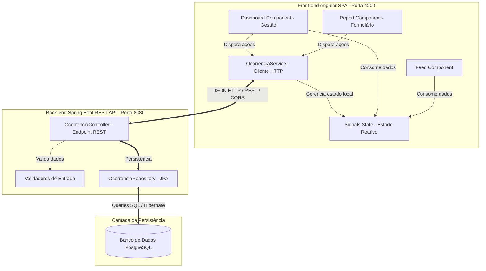

# 📑 Relatório de Arquitetura de Software: JampaSafe

Este documento apresenta a especificação arquitetural do sistema **JampaSafe**, desenvolvido como projeto de disciplina para a cadeira de Programação Web 1. O sistema é um monitor de zeladoria urbana voltado para a cidade de João Pessoa, permitindo o registro, consulta e gerenciamento de ocorrências públicas (como problemas de infraestrutura, iluminação e limpeza pública).

---

## 1. Visão Geral do Sistema

O JampaSafe foi construído utilizando um modelo de arquitetura **Cliente-Servidor** desacoplado, composto por:
*   **Front-end (Cliente)**: Uma aplicação Single Page Application (SPA) desenvolvida em **Angular (v18+)** com componentes standalone, aproveitando recursos de reatividade fina com *Signals*.
*   **Back-end (Servidor)**: Uma API RESTful desenvolvida em **Spring Boot (v3.x)** e **Java 17**, responsável pelas regras de negócio, validação de dados e exposição dos endpoints HTTP.
*   **Banco de Dados (Persistência)**: Um banco de dados relacional **PostgreSQL**, gerenciado por meio do **Spring Data JPA** e **Hibernate**.

A comunicação entre o cliente e o servidor ocorre de forma assíncrona por meio de requisições e respostas HTTP, utilizando payloads em formato **JSON**.

---

## 2. Diagrama Arquitetural

O fluxo de dados e a divisão de responsabilidades do sistema podem ser representados pelo seguinte diagrama:



---

## 3. Arquitetura do Front-End (Angular v18+)

O front-end foi estruturado de forma modular e baseia-se em conceitos modernos do ecossistema Angular. A estrutura do código-fonte localiza-se sob a pasta `src/app/` e divide-se em três camadas principais para garantir alta manutenibilidade e baixo acoplamento:

### 3.1. Divisão em Camadas de Pastas
1.  **`core/`**: Centraliza tudo o que é de escopo global da aplicação.
    *   `models/`: Contém as definições de interfaces do TypeScript (como o [ocorrencia.model.ts](file:///C:/Users/paraa/Desktop/IFPB/4%C2%B0%20per%C3%ADodo/pw1/JampaSafe/jampasafe/src/app/core/models/ocorrencia.model.ts)).
    *   `services/`: Centraliza a comunicação com a API REST através de serviços singleton, como o [ocorrencia.service.ts](file:///C:/Users/paraa/Desktop/IFPB/4%C2%B0%20per%C3%ADodo/pw1/JampaSafe/jampasafe/src/app/core/services/ocorrencia.service.ts).
2.  **`features/`**: Contém as telas (views) e as regras específicas de cada fluxo funcional da aplicação.
    *   `feed/`: Lista as ocorrências abertas pela população em ordem cronológica reversa.
    *   `report/`: Apresenta o formulário para criação de novas ocorrências com validação em tempo real.
    *   `dashboard/`: Tela exclusiva do gestor público para acompanhamento e transição de status das ocorrências (Ex: *Pendente* para *Em Progresso* ou *Resolvido*).
3.  **`shared/`**: Comportamentos e componentes reutilizáveis entre múltiplas telas, como o `header/`.

### 3.2. Destaques Técnicos do Front-end
*   **Gerenciamento de Estado Reativo com Signals**: Substituindo a verbosidade do RxJS puro (BehaviorSubject) em operações simples, o sistema utiliza `signal()` e `computed()` no `OcorrenciaService`. Isso permite reatividade fina (*fine-grained reactivity*), onde o Angular atualiza especificamente o nó do DOM alterado, otimizando drasticamente a performance.
*   **Injeção de Dependência Moderna com `inject()`**: Ao invés do construtor tradicional, componentes e serviços utilizam a função `inject(HttpClient)` e `inject(OcorrenciaService)`, deixando o código mais conciso e alinhado ao padrão moderno do Angular.
*   **Novo Fluxo de Controle Nativo (@for, @if, @empty)**: Utilização dos blocos nativos incorporados diretamente no template HTML, que eliminam a necessidade de carregar diretivas como `*ngIf` e `*ngFor` no `CommonModule`, além de fornecer um fallback integrado com `@empty` quando não há registros na listagem.
*   **Formulários Reativos Estritos (ReactiveForms)**: Validações robustas aplicadas no lado do cliente para garantir que o payload HTTP enviado ao servidor seja pré-validado, aumentando a qualidade do feedback visual para o usuário.

---

## 4. Arquitetura do Back-End (Spring Boot 3.x)

O back-end foi implementado em Java seguindo o padrão arquitetural de camadas **MVC (Model-View-Controller)**, atuando essencialmente como uma API REST exposta na porta `8080`.

### 4.1. Estrutura do Pacote Java (`com.jampasafe.api`)
A divisão interna segue a especialização por responsabilidades:

1.  **`model` ([Ocorrencia.java](file:///C:/Users/paraa/Desktop/IFPB/4%C2%B0%20per%C3%ADodo/pw1/JampaSafe/jampasafe/jampasafe-api/src/main/java/com/jampasafe/api/model/Ocorrencia.java))**:
    *   Representa a entidade JPA que mapeia o objeto Java diretamente para a tabela `tb_ocorrencia` no banco de dados relacional.
    *   Usa anotações do Jakarta Persistence para definir chaves primárias autoincrementais (`@Id`, `@GeneratedValue(strategy = GenerationType.IDENTITY)`) e restrições de coluna como `nullable = false` e tamanho de texto (`columnDefinition = "TEXT"`).
2.  **`repository` ([OcorrenciaRepository.java](file:///C:/Users/paraa/Desktop/IFPB/4%C2%B0%20per%C3%ADodo/pw1/JampaSafe/jampasafe/jampasafe-api/src/main/java/com/jampasafe/api/repository/OcorrenciaRepository.java))**:
    *   Interface que estende `JpaRepository<Ocorrencia, Long>`.
    *   Utiliza a infraestrutura do Spring Data para abstrair consultas SQL. O Spring cria dinamicamente a implementação contendo todas as operações de CRUD padrão (`save`, `findAll`, `findById`, `deleteById`, `existsById`).
3.  **`controller` ([OcorrenciaController.java](file:///C:/Users/paraa/Desktop/IFPB/4%C2%B0%20per%C3%ADodo/pw1/JampaSafe/jampasafe/jampasafe-api/src/main/java/com/jampasafe/api/controller/OcorrenciaController.java))**:
    *   Porta de entrada para requisições HTTP externas (`@RestController` e `@RequestMapping("/api/ocorrencias")`).
    *   Possui injeção de dependência via construtor do `OcorrenciaRepository`, promovendo testabilidade e acoplamento fraco.
    *   Implementa regras de validação manual de payload (`validarOcorrencia`) para impedir que dados nulos, em branco ou malformados cheguem à base de dados.
    *   Gerencia os códigos de status HTTP apropriados para cada resposta.

### 4.2. Segurança e Controle de CORS
Com a arquitetura separada em duas portas de execução (`http://localhost:4200` para o cliente e `http://localhost:8080` para o servidor), o navegador bloquearia requisições cruzadas por motivos de segurança. 
Para resolver isso de forma elegante, foi adicionada a anotação:
```java
@CrossOrigin(origins = "http://localhost:4200")
```
diretamente no `OcorrenciaController`, instruindo o Spring Boot a liberar os cabeçalhos de CORS (*Cross-Origin Resource Sharing*) especificamente para a origem do front-end Angular.

---

## 5. Interface de Comunicação (Contratos da API REST)

A comunicação é estruturada de acordo com os princípios RESTful. A tabela a seguir especifica os endpoints disponíveis:

| Método HTTP | Endpoint | Descrição | Status de Sucesso | Status de Erro |
| :--- | :--- | :--- | :--- | :--- |
| **GET** | `/api/ocorrencias` | Lista todas as ocorrências cadastradas no banco de dados. | `200 OK` | `-` |
| **GET** | `/api/ocorrencias/{id}` | Busca os detalhes de uma ocorrência específica por seu ID. | `200 OK` | `404 Not Found` |
| **POST** | `/api/ocorrencias` | Cria uma nova ocorrência com os dados fornecidos no body. | `21 Created` | `400 Bad Request` |
| **PUT** | `/api/ocorrencias/{id}` | Atualiza todos os dados de uma ocorrência existente. | `200 OK` | `404 Not Found` / `400 Bad Request` |
| **DELETE** | `/api/ocorrencias/{id}` | Remove permanentemente uma ocorrência do sistema. | `204 No Content` | `404 Not Found` |

### Exemplo de Payload JSON (Envio / Recebimento)
Ao criar (`POST`) ou atualizar (`PUT`) uma ocorrência, o JSON trafegado segue o formato:
```json
{
  "titulo": "Buraco na pista principal",
  "descricao": "Cratera na via principal impedindo fluxo normal de trânsito.",
  "localizacao": "Mangabeira",
  "categoria": "Infraestrutura",
  "status": "PENDENTE"
}
```

---

## 6. Persistência de Dados (PostgreSQL)

O banco de dados do sistema roda sob o **PostgreSQL** (configurado conforme o arquivo [application.properties](file:///C:/Users/paraa/Desktop/IFPB/4%C2%B0%20per%C3%ADodo/pw1/JampaSafe/jampasafe/jampasafe-api/src/main/resources/application.properties)). 

### 6.1. Propriedades de Persistência
*   **Driver**: `org.postgresql.Driver`
*   **Porta padrão**: `5432`
*   **Estratégia DDL**: `spring.jpa.hibernate.ddl-auto=update`
    *   *Nota técnica*: O Hibernate gera e altera a estrutura da tabela no banco de dados automaticamente com base nas alterações feitas na classe `Ocorrencia.java`. Isso simplifica o deploy e o ciclo de desenvolvimento acadêmico, eliminando a necessidade de criar scripts SQL manuais de inicialização.

### 6.2. Estrutura Física da Tabela `tb_ocorrencia`
O mapeamento JPA resulta na seguinte estrutura física no banco PostgreSQL:

*   `id`: `BIGINT` (Chave Primária com autoincremento serial)
*   `titulo`: `VARCHAR(255)` (Obrigatório)
*   `descricao`: `TEXT` (Obrigatório, para aceitar textos longos)
*   `localizacao`: `VARCHAR(255)` (Obrigatório, bairro do relato)
*   `categoria`: `VARCHAR(255)` (Obrigatório, mapeado para regras de estilo do CSS no Angular)
*   `status`: `VARCHAR(255)` (Obrigatório, PENDENTE, EM_ANDAMENTO ou RESOLVIDO)
*   `data_criacao`: `TIMESTAMP` (Gera automaticamente a hora local do registro via `LocalDateTime.now()`)

---

## 7. Integração e Adaptação de Dados (Data Mapping)

Uma característica essencial desta arquitetura é o **desacoplamento dos modelos de dados** do front-end e do back-end. 

No back-end, convenciona-se o uso de padrões corporativos do banco de dados (ex: `data_criacao` e `localizacao`). No front-end, convenciona-se a usabilidade do código TypeScript (ex: `dataRelato` e `bairro`, em *camelCase*). 

Para resolver essa divergência de termos sem acoplar as tecnologias, o [OcorrenciaService](file:///C:/Users/paraa/Desktop/IFPB/4%C2%B0%20per%C3%ADodo/pw1/JampaSafe/jampasafe/src/app/core/services/ocorrencia.service.ts) implementa funções mapeadoras:
1.  **`mapToFrontend()`**: Converte as chaves do objeto de resposta da API (`ApiOcorrencia`) para a tipagem rigorosa do TypeScript (`Ocorrencia`).
2.  **`mapToApi()`**: Converte o estado do front-end para o JSON esperado pelas requisições do Spring Boot.
3.  **Mapeadores de Status**: Adaptam os enums do frontend (`pendente`, `em-progresso`, `resolvido`) para os enums corporativos de banco do backend (`PENDENTE`, `EM_ANDAMENTO`, `RESOLVIDO`).

---

## 8. Conclusão e Destaques para a Apresentação

Esta arquitetura apresenta as melhores práticas exigidas para uma aplicação web moderna:
1.  **Desacoplamento claro**: As aplicações frontend e backend podem evoluir de forma independente. Caso o banco de dados mude para outro SGDB, ou se mude o framework do frontend, as interfaces e endpoints REST garantem que nenhum lado quebre.
2.  **Uso de Recursos de Ponta**: O frontend Angular não utiliza códigos legados; é reativo por padrão através de **Signals**, gerando alta performance e templates limpos com o novo **Control Flow**.
3.  **Back-end Robusto**: Spring Boot fornece um container de injeção sólido, validação ativa em nível de Controller e persistência simplificada e automática com Spring Data JPA.
